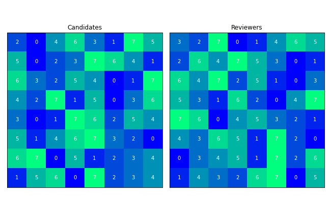
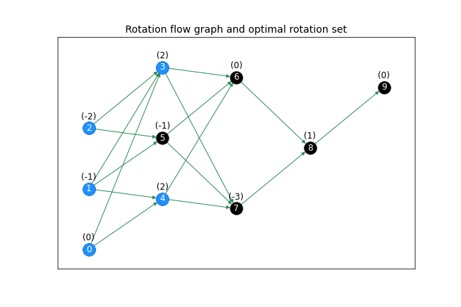

# assignment

This module provides a lightweight implementation of the Gale-Shapley stable assignment (proposal) algorithm and a few tools for exploring the stable assignment polytope, including a modified implementation of the optimal stable marriage algorithm described by in the following reference:

- Irving, Robert W., Paul Leather, and Dan Gusfield. 1987. &ldquo;An Efficient Algorithm for the &lsquo;Optimal&rsquo; Stable Marriage.&rdquo; *Journal of the Association for Computing Machinery* 34, no. 3 (July): 532&ndash;43.

Please see the Jupyter notebooks in the root directory for usage examples and a mathematical discussion of the rotation algorithm.